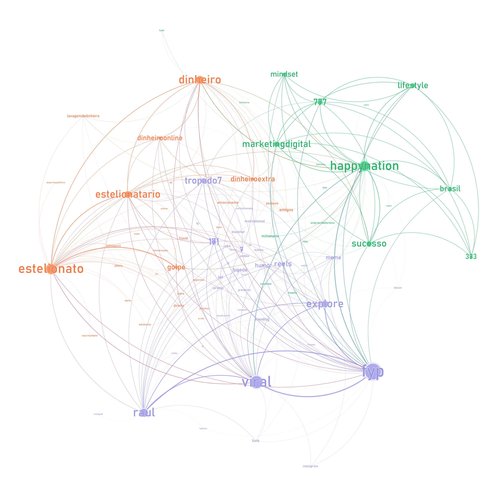
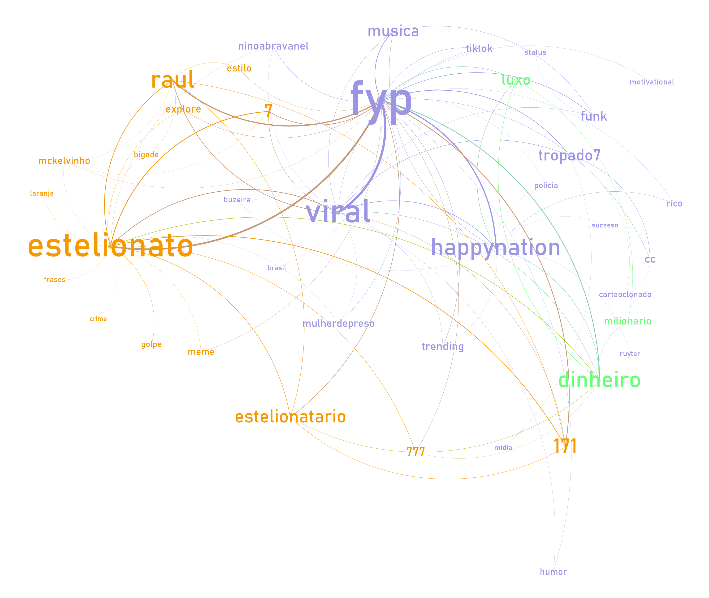

**DOCUMENTO METODOLÓGICO INTEGRADO**

Redes de coocorrência de hashtags em Instagram e TikTok no ecossistema discursivo do estelionato e da monetização ilícita

*Memória metodológica · Apêndice técnico · Guia de replicação*

Sumário

[1. Objetivo da análise](#sec_1_objetivo_da_analise)

[2. Construção dos corpora](#sec_2_construcao_dos_corpora)

[3. Dimensão etnográfica complementar](#sec_3_dimensao_etnografica_complementar)

[4. Inspeção inicial das bases](#sec_4_inspecao_inicial_das_bases)

[5. Extração e contagem de frequências](#sec_5_extracao_e_contagem_de_frequencias)

[6. Construção dos dicionários analíticos](#sec_6_construcao_dos_dicionarios_analiticos)

[7. Aplicação da limpeza](#sec_7_aplicacao_da_limpeza)

[8. Construção das redes](#sec_8_construcao_das_redes)

[9. Visualização e análise no Gephi](#sec_9_visualizacao_e_analise_no_gephi)

[10. Principais resultados empíricos](#sec_10_principais_resultados_empiricos)

[11. Comparação entre plataformas](#sec_11_comparacao_entre_plataformas)

[12. Síntese metodológica](#sec_12_sintese_metodologica)

1. Objetivo da análise

Esta pesquisa investiga os **ecossistemas discursivos digitais** associados ao estelionato, aos golpes financeiros, à monetização ilícita e às estratégias de viralização em duas plataformas de mídia social — **Instagram** e **TikTok**. O objeto não é uma peça isolada de conteúdo fraudulento, mas a **gramática coletiva** com que esse conteúdo é produzido, etiquetado e distribuído: o conjunto de marcadores (hashtags) que os produtores empregam para inscrever suas publicações em circuitos de visibilidade, comunidade e mercado.

O objetivo geral é **mapear e comparar** como o discurso do crime financeiro digital se organiza em cada plataforma, identificando: (a) o vocabulário temático recorrente; (b) os agrupamentos semânticos que estruturam o campo (crime, riqueza, viralização, entretenimento); (c) as personas e os marcadores que funcionam como pontes entre esses agrupamentos; e (d) as estratégias de visibilidade específicas de cada ambiente algorítmico.

A escolha pela **análise de redes de coocorrência de hashtags** decorre de três propriedades do método. Primeiro, as hashtags são **autodeclarações de pertencimento**: ao etiquetar uma publicação, o autor a posiciona deliberadamente em um campo discursivo, o que torna a hashtag um traço observável da intenção comunicativa. Segundo, a **coocorrência** — duas hashtags presentes no mesmo post — revela associações que não estão explícitas em nenhuma publicação individual, mas emergem do padrão agregado; é a coocorrência que expõe, por exemplo, que o vocabulário do estelionato circula sistematicamente acoplado ao vocabulário da viralização. Terceiro, a representação em **grafo** permite aplicar métricas formais (centralidade, modularidade, grau ponderado) que transformam impressões qualitativas em indicadores estruturais comparáveis entre plataformas.

A estratégia analítica foi **espelhada**: o procedimento desenvolvido originalmente para o Instagram foi reproduzido integralmente para o TikTok, com os mesmos limiares, as mesmas categorias de codificação e a mesma lógica de construção de rede, ajustando-se apenas o que era estritamente imposto pelas diferenças de estrutura das bases. Isso garante que as diferenças observadas entre as redes finais reflitam diferenças reais entre as plataformas, e não artefatos de método.

O desenho é, por fim, **misto**: a análise de redes de coocorrência mapeia a estrutura do campo em escala, mas opera sobre metadados textuais e não captura o conteúdo audiovisual dos vídeos — elemento central nessas plataformas. Por isso, o estudo é complementado por uma **dimensão etnográfica** (Seção 3), que acessa diretamente o conteúdo audiovisual e a dinâmica de campo que escapam à coleta automatizada.

2. Construção dos corpora

2.1 Coleta dos dados

A coleta foi conduzida com instrumentação idêntica nas duas plataformas, o que é condição para a comparabilidade. Utilizou-se a extensão **Zeeschuimer** conectada ao **4CAT** (*Capture and Analysis Toolkit*), capturando as publicações diretamente da navegação. Para evitar a personalização algorítmica do feed por históricos preexistentes, **foram criadas contas novas** no TikTok e no Instagram especificamente para a coleta.

A busca foi feita **por hashtags**, a partir de um conjunto de **seis hashtags-semente** comuns às duas plataformas:

\#estelionato · \#estelionatario · \#raul · \#happynation · \#tropado7 · \#171

Essas seis sementes geraram, **em cada plataforma**, **6 planilhas de entrada** — uma por hashtag de busca — posteriormente consolidadas em uma base mestra única. Duas decisões de coleta merecem registro: (i) a busca **não aplicou filtro de datas**, porque as plataformas não permitem essa opção na busca por hashtag — o corpus é, portanto, um recorte do material disponível no momento da captura, sem janela temporal controlada; (ii) a hashtag **\#bigode foi deliberadamente excluída** do conjunto de sementes, pois os posts recuperados por ela se afastavam do objeto (referiam-se majoritariamente a *bigode* no sentido de pelos faciais). Vale notar que bigode **permanece como nó nas redes finais** — não como semente, mas como hashtag interna às publicações, onde designa a persona "Raul Bigode"; sua exclusão como semente não a remove do campo discursivo capturado por outras sementes.

A meta de coleta era de **cerca de 500 posts por hashtag**. Esse alvo foi alcançado no Instagram, mas **não no TikTok**, em razão de **limitações próprias da plataforma** (restrições de paginação/raspagem na busca por hashtag). Essa é a origem direta da assimetria de tamanho entre os corpora — um ponto metodológico importante, retomado em 2.4.

2.2 Consolidação em bases mestras

**Instagram.** As 6 planilhas de entrada (uma por semente) foram **consolidadas em uma base mestra única** — dataset\_consolidado\_instagram.xlsx —, eliminando a fragmentação por hashtag de busca e permitindo o tratamento do conjunto como corpus integrado. A base contém **3.611 publicações** (≈3.612), com **legendas na coluna G** e **hashtags na coluna S**.

**TikTok.** Da mesma forma, o TikTok partiu de **6 planilhas de entrada** — uma por hashtag-semente — **consolidadas em uma base mestra única**, dataset\_consolidado\_tiktok.xlsx, com **1.957 publicações** distribuídas em 36 colunas de metadados (autoria, métricas de engajamento, áudio, sinalizações de conteúdo etc.). A legenda corresponde à coluna **I (body)** e as **hashtags à coluna AD (hashtags)**.

O procedimento de consolidação foi, portanto, **idêntico nas duas plataformas**: seis planilhas de entrada (uma por semente) reunidas em uma base mestra única. A partir dela, todo o tratamento subsequente é o mesmo.

2.3 Tabela comparativa dos corpora

|                      |                                                               |                                   |
| -------------------- | ------------------------------------------------------------- | --------------------------------- |
| **Dimensão**         | **Instagram**                                                 | **TikTok**                        |
| Ferramenta de coleta | Zeeschuimer + 4CAT                                            | Zeeschuimer + 4CAT                |
| Contas utilizadas    | novas, criadas para a coleta                                  | novas, criadas para a coleta      |
| Hashtags-semente     | estelionato, estelionatario, raul, happynation, tropado7, 171 | (as mesmas 6 sementes)            |
| Filtro de datas      | nenhum (não permitido)                                        | nenhum (não permitido)            |
| Meta por hashtag     | \~500 posts (atingida)                                        | \~500 posts (**não atingida**)    |
| Planilhas de entrada | 6 (uma por semente)                                           | 6 (uma por semente)               |
| Base mestra          | dataset\_consolidado\_instagram.xlsx                          | dataset\_consolidado\_tiktok.xlsx |
| Publicações totais   | **3.611** (≈3.612)                                            | **1.957**                         |
| Coluna de legenda    | G                                                             | I (body)                          |
| Coluna de hashtags   | **S**                                                         | **AD**                            |

2.4 Achados e ressalvas desta etapa

**A assimetria de tamanho é, em parte, um artefato de coleta.** O corpus do Instagram é cerca de **1,8 vez maior** que o do TikTok (3.611 vs 1.957 publicações), mas essa diferença **não reflete necessariamente um ecossistema discursivo menor no TikTok** — decorre, sobretudo, do **teto de raspagem** imposto pela plataforma, que impediu atingir a meta de \~500 posts por semente. Em consequência, todos os indicadores absolutos (número de nós, arestas, peso total) devem ser lidos com cautela, privilegiando-se a **estrutura relativa** (proporções, posições, densidade, modularidade) sobre as **magnitudes brutas**.

**Efeito de seleção das sementes (reflexividade amostral).** Como o corpus foi construído a partir de seis hashtags-semente, essas mesmas hashtags — estelionato, estelionatario, raul, happynation, tropado7, 171 — tendem a ser, **por construção**, as mais frequentes e mais centrais nas redes. A centralidade dessas seis hashtags deve, portanto, ser interpretada como **parcialmente induzida pelo desenho amostral**, não como achado emergente. O valor analítico das redes está menos na proeminência das sementes e mais (i) no que **coocorre** com elas (o vocabulário associado que não foi buscado diretamente) e (ii) nas **comparações entre plataformas**, em que o desenho amostral é idêntico e, portanto, se cancela. Como as seis sementes são comuns às duas plataformas, qualquer **diferença estrutural** observada entre as redes não pode ser atribuída à escolha das sementes.

3. Dimensão etnográfica complementar

3.1 A lacuna do conteúdo audiovisual

A coleta automatizada descrita na Seção 2 captura metadados estruturados — texto, hashtags, métricas de engajamento, informações de autoria —, mas **não captura o conteúdo audiovisual dos vídeos**. Essa é uma limitação relevante: em plataformas como Instagram e TikTok, o vídeo é o elemento central da publicação, e boa parte do sentido do objeto pesquisado (a performance do golpe, a encenação da riqueza, os códigos visuais do grupo) só é acessível pela observação direta da peça audiovisual, não pelos metadados textuais que a acompanham.

3.2 Abordagem etnográfica como complemento

Para mitigar essa lacuna, a equipe complementou a coleta automatizada com uma **imersão em campo de orientação etnográfica**, informada por Hine (2015) e pelas potências adaptativas da etnografia em ambientes digitais — uma estratégia adequada para acessar um campo que, em ato, escapa às coletas automatizadas centradas em metadados.

O procedimento de campo foi o seguinte:

  - utilizou-se uma **conta no Instagram sem publicações, sem seguidores e sem perfis seguidos** — um perfil "limpo", sem histórico capaz de enviesar a curadoria algorítmica;

  - a partir dessa conta, a pesquisa partiu do **primeiro vídeo sobre o objeto de pesquisa exibido na aba "Explorar"**, deixando a navegação subsequente ser conduzida pela recomendação da própria plataforma;

  - a equipe **não curtiu nem comentou** nenhuma publicação, de modo a não interferir no campo nem deixar rastro de interação;

  - a interação observacional limitou-se a **abrir os comentários** das publicações e **salvar os vídeos de interesse**, usando o recurso de salvamento nativo da própria plataforma.

Essa rotina preserva, tanto quanto possível, a posição de observação não participante: a conta não emite sinais de engajamento que poderiam realimentar o algoritmo de recomendação ou ser percebidos pelos perfis observados, e o material é arquivado por um mecanismo já previsto pela plataforma, sem extração externa do vídeo em si.

3.3 Acervo produzido

A imersão etnográfica resultou em um **acervo de publicações selecionadas no Instagram entre maio e setembro de 2025**, distribuído por tipo penal de referência:

|                                          |                 |                 |
| ---------------------------------------- | --------------- | --------------- |
| **Categoria**                            | **Publicações** | **% do acervo** |
| Estelionato                              | 81              | 62,3%           |
| Furto simples                            | 30              | 23,1%           |
| Roubo mediante violência ou grave ameaça | 19              | 14,6%           |
| **Total**                                | **130**         | **100%**        |

Esse acervo qualitativo é **complementar, e não substitutivo**, ao corpus quantitativo das Seções 2, 5 e 6: enquanto a base estruturada permite mapear o vocabulário e a rede de coocorrência de hashtags em escala (3.611 e 1.957 publicações, respectivamente), o acervo etnográfico permite examinar **em profundidade** uma amostra menor e curada, ancorando a leitura estrutural das redes em observação direta do conteúdo audiovisual e da dinâmica de campo.

3.4 Considerações éticas

A natureza do objeto — comunidades que operam **regimes de visibilidade ambíguos** e que veiculam **representações explícitas de atos potencialmente enquadráveis como criminosos** — impõe cuidados éticos específicos, sob risco de a própria pesquisa expor as pessoas que publicam esse conteúdo a reações persecutórias. Em vista disso, adotaram-se as seguintes medidas:

  - **anonimização dos nomes de usuário** mencionados ao longo do texto;

  - **referência indireta aos dados de campo**, evitando-se descrições que permitam a identificação de perfis ou publicações específicas;

  - **omissão dos códigos identificadores (IDs)** das publicações referenciadas no corpo do texto, tanto por resguardo ético quanto por fluidez narrativa.

A ética da pesquisa é assumida como constitutiva de sua construção, e não como uma camada de conformidade aposta a posteriori: as escolhas metodológicas de não interação (não curtir, não comentar), de anonimização e de referência indireta são parte do desenho do estudo, não apenas salvaguardas formais.

4. Inspeção inicial das bases

4.1 Localização e formato das hashtags

Em ambas as plataformas as hashtags estão armazenadas como **uma lista separada por vírgulas** dentro de uma única célula por publicação (coluna S no Instagram, coluna AD no TikTok), predominantemente em minúsculas e **sem o caractere \#**. Essa convergência de formato é o que torna o tratamento espelhado viável.

4.2 Problemas e inconsistências identificados

A inspeção sistemática da base do TikTok (replicando a auditoria feita no Instagram) revelou os seguintes problemas, todos com paralelo no corpus do Instagram:

**(a) Publicações sem hashtag.** No TikTok, **220 das 1.957 publicações (11,2%)** não têm nenhuma hashtag. No Instagram, **485 das 3.611 publicações** estavam nessa condição, restando **3.126 publicações com hashtag**. Posts sem hashtag permanecem no corpus para fins de estatística descritiva, mas **não contribuem para a rede**, pois não geram coocorrências.

**(b) Duplicações internas.** Hashtags repetidas dentro do mesmo post (ex.: viral,viral,paineldo7 no TikTok). Foram identificados **62 posts** com duplicação interna no TikTok. Se não tratadas, essas repetições inflariam artificialmente tanto a frequência quanto os pesos das arestas.

**(c) Emojis anexados.** **164 posts** do TikTok contêm emojis incorporados às hashtags (ex.: mulherdepreso🔓🕊👫💍, fypシ, dinheiroonline💰). O mesmo fenômeno ocorre no Instagram (brasil🇧🇷, viralpost❤️, vaiprofybct😡). Emojis criam **falsas variantes** de uma mesma hashtag.

**(d) Maiúsculas/minúsculas.** **5 posts** do TikTok apresentam maiúsculas. A não normalização faria Dinheiro e dinheiro contarem como tags distintas.

**(e) Variantes ortográficas e idiomáticas.** Equivalentes em português e inglês (dinheiro/money, viral/viralvideo), erros de digitação (fouryou), e variantes morfológicas (singular/plural, com/sem acento).

**(f) Hashtags extremamente alongadas.** Repetição expressiva de caracteres como recurso de ênfase/viralização: no TikTok, fyppppppppppppppppppppppp (39 ocorrências), paratiiiiiiiiiiiiiiiiiiiiiiiiiiiiiii (21), fyyyyyyyyyyyyyyyy (33); no Instagram, sequências análogas de fyp e fy com dezenas de caracteres repetidos.

4.3 Tratamento aplicado a cada problema

|                        |                                                |              |
| ---------------------- | ---------------------------------------------- | ------------ |
| **Problema**           | **Tratamento**                                 | **Etapa**    |
| Posts sem hashtag      | Mantidos no corpus; excluídos da rede          | Extração     |
| Duplicação interna     | Deduplicação por presença dentro do post       | Extração     |
| Emojis                 | Unificação à forma textual limpa (categoria U) | Dicionário   |
| Maiúsculas             | Conversão a minúsculas (lower())               | Normalização |
| Variantes ortográficas | Unificação a uma forma canônica (categoria U)  | Dicionário   |
| Alongamentos           | Unificação à forma base (ex.: fyp... → fyp)    | Dicionário   |

4.4 Achados desta etapa

A auditoria mostra que os dois corpora compartilham os **mesmos modos de "sujeira"**: ausência de hashtags, repetição interna, emojis, alongamentos e variantes. Isso é, em si, um achado: as práticas de etiquetagem nas duas plataformas seguem **gramáticas semelhantes de viralização** (alongar fyp, decorar com emojis, repetir o apelo ao algoritmo). A consequência metodológica é que **o mesmo conjunto de procedimentos de limpeza se aplica às duas bases**, validando a estratégia espelhada.

5. Extração e contagem de frequências

5.1 Procedimento

A extração transforma a célula-lista em uma lista de hashtags analisáveis. A implementação é em **R** (pacotes tidyverse — dplyr, tidyr, stringr, purrr — e igraph; o código completo está no Apêndice B). Para o Instagram, o script:

1.  seleciona a coluna de hashtags (coluna S, índice 19) e a desmembra com separate\_rows(sep = ","), gerando **uma linha por ocorrência de hashtag**;

2.  **normaliza** cada token: str\_trim() (remove espaços) e tolower() (minúsculas);

3.  descarta tokens vazios ou NA;

4.  **conta a frequência** com count(tags) — ou seja, sobre as **ocorrências brutas**.

Um ponto metodológico essencial, evidenciado pelo código: nessa etapa a frequência é contada **por ocorrência bruta**, e **não** por presença no post — uma hashtag repetida dentro de um mesmo post é contada mais de uma vez. A **deduplicação intra-post** só é aplicada **mais adiante**, em dois momentos: (i) na função de limpeza (unique() sobre as hashtags resolvidas de cada post) e (ii) na construção da rede (unique() antes de gerar os pares). Assim, a **tabela de frequências e os cortes** operam sobre ocorrências brutas, ao passo que a **frequência dos nós** (recontada a partir da coluna limpa) e as **arestas** operam sobre presença-por-post. Essa distinção explica por que a frequência de uma hashtag na tabela é, em geral, ligeiramente superior à sua frequência como nó.

Para o TikTok, o mesmo script foi aplicado, ajustando-se apenas o **índice da coluna de hashtags** (coluna AD em vez de S=19); todos os demais princípios — separação por vírgula, normalização, contagem bruta e deduplicação tardia — são idênticos.

5.2 Resultados

No TikTok foram contabilizadas **9.149 ocorrências brutas** de hashtags, distribuídas em **2.967 hashtags distintas**. No Instagram, foram **21.812 ocorrências** e **5.048 hashtags distintas**. (A título de referência, a deduplicação intra-post removeria 91 repetições no TikTok, reduzindo o total a 9.058 — mas a contagem oficial, como no script, é a bruta.)

5.3 Tabela comparativa de frequências e cortes

|                                       |               |            |
| ------------------------------------- | ------------- | ---------- |
| **Métrica**                           | **Instagram** | **TikTok** |
| Ocorrências brutas (contagem oficial) | 21.812        | 9.149      |
| **Hashtags distintas**                | **5.048**     | **2.967**  |
| Publicações com hashtag               | 3.126         | 1.737      |
| Publicações sem hashtag               | 485           | 220        |
| Hashtags com **n ≥ 3**                | 963           | 425        |
| Hashtags com **n ≥ 10**               | **291**       | **103**    |
| Hashtags com **n ≥ 20**               | 138           | 51         |

5.4 Hashtags mais frequentes (topo das distribuições)

|             |                   |                   |
| ----------- | ----------------- | ----------------- |
| **Posição** | **Instagram (n)** | **TikTok (n)**    |
| 1           | raul (816)        | fyp (520)         |
| 2           | estelionato (576) | estelionato (349) |
| 3           | happynation (540) | viral (251)       |
| 4           | tropado7 (493)    | happynation (240) |
| 5           | 171 (430)         | raul (237)        |

*Observação: a frequência da etapa de contagem (acima, bruta) e a frequência registrada nos nós da rede (Seção 8) divergem ligeiramente para algumas hashtags por dois motivos cumulativos: no nó, a frequência (i) é **deduplicada por post** e (ii) **incorpora as unificações** — por exemplo, fyp no nó da rede agrega fy, foryou, fypシ, foruyou, foryourpage etc.*

5.5 Justificativa do limiar n ≥ 10

Foram testados três pontos de corte em ambas as plataformas. O limiar **n ≥ 10** foi escolhido para a etapa de codificação pelos mesmos três motivos nas duas bases:

  - **preserva a diversidade temática** — não descarta campos semânticos relevantes que aparecem com frequência moderada;

  - **elimina muito ruído** — remove a cauda longa de hashtags idiossincráticas, erros e termos de ocorrência única;

  - **mantém um conjunto administrável** — viabiliza a **codificação manual** de cada hashtag, etapa que seria inviável com as 963/425 hashtags do corte ≥3.

O efeito do corte é comparável: o Instagram passa de 5.048 para **291 hashtags candidatas** (5,8% do vocabulário) e o TikTok de 2.967 para **103** (3,5%). Em ambos os casos, esse pequeno conjunto de hashtags frequentes concentra a maior parte das ocorrências e define o esqueleto do campo discursivo.

6. Construção dos dicionários analíticos

6.1 Procedimento de codificação

As hashtags com n ≥ 10 (291 no Instagram, 103 no TikTok) foram exportadas e submetidas a **codificação**. No Instagram, a codificação foi **manual**, item a item, e o dicionário resultante foi reaplicado por um script em R (Apêndice B, Scripts 8–12). No TikTok, ela foi **semiautomática**: cada hashtag recebeu uma classificação preliminar gerada a partir dos critérios e do **dicionário do Instagram como modelo analítico** (matching direto de equivalentes, detecção de variantes e aplicação das regras temáticas), seguida de revisão e da explicitação dos casos ambíguos para validação humana. O dicionário é gravado como uma planilha com as colunas tags, ação e substituir por (no TikTok, acrescidas de n, justificativa e marcação de ambiguidade).

6.2 As três categorias

  - **M — Manter.** A hashtag integra o objeto da pesquisa e é preservada como nó da rede.

  - **U — Unificar.** A hashtag é uma variante de outra forma; é substituída por uma **forma canônica** (preenchida em substituir por), de modo a colapsar redundâncias sem perder significado.

  - **R — Remover.** A hashtag é ruído sem relação temática e é eliminada.

6.3 Critérios

**Manter (M):** hashtags relacionadas a estelionato, fraude, golpes, criminalidade, segurança, monetização, empreendedorismo, enriquecimento, marketing digital, plataformas, viralização, circulação de conteúdo e personas centrais do ecossistema. Exemplos (ambas as plataformas): estelionato, dinheiro, golpe, 171, cc, cartaoclonado, raul, tropado7, happynation, fyp, viral.

**Remover (R):** fandoms, celebridades, futebol, música/personagens sem relação, memes sem vínculo temático, hashtags estrangeiras irrelevantes, spam e ruído algorítmico. No Instagram: realmadrid, snowman, gato, toda a constelação de asensio *(jogador de futebol), airmaxtn. No TikTok: gta, games, house, edit, lyrics, tipografia, capcut, rj, carros.*

**Unificar (U):** variações ortográficas, singular/plural, acentuação, equivalentes idiomáticos, versões com emoji e variantes de viralização. Exemplos no Instagram: dinheirofácil → dinheiroextra, rendaextra → dinheiroextra, fy → fyp, fypage → fyp, reelsinstagram → reels. No TikTok: money → dinheiro, foryou → fyp, viralvideos → viral, luxury → luxo.

6.4 Principais decisões de unificação (por campo semântico)

Os mesmos núcleos canônicos organizam as duas plataformas:

  - **fyp (viralização algorítmica).** Absorve fy, foryou, foryoupage, fouryou, fypage, fypシ, fypp, todos os alongamentos (fyp..., fy...) e apelos como vaiprofycaramba. No TikTok, inclui ainda parati e suas elongações (paratiiiii…), por serem o equivalente português de *for you*. No Instagram, esse núcleo coexiste com explore, reels e feed (este último também unificado a fyp).

  - **viral (circulação).** Absorve viraliza, viralvideo(s), viraltiktok, videoviral, viral\_video. trend → trending em ambas.

  - **dinheiro (núcleo financeiro).** money → dinheiro. No Instagram, todo o feixe de renda (rendaextra, rendafixa, dinheirofácil, viradadesaldo) converge para dinheiroextra.

  - **Marketing digital.** No Instagram, market, marketing, mktdigital → marketingdigital. No TikTok, o campo aparece sobretudo via tiktokshop e trabalhecomartistas (este último sinalizado como ambíguo).

  - **estilo (estilo de vida).** estilodevida → estilo (Instagram); lifestyle → estilo (TikTok).

  - **luxo (ostentação).** luxury, luxurylife, luxurylifestyle, mansion → luxo (TikTok). No Instagram, o campo de ostentação inclui ainda oldmoney, grife, marcas (armani, nike, lacoste).

  - **musica (entretenimento).** music, song, songs, slowed, slowedsongs, phonk → musica (TikTok). Decisão deliberada de **manter** a camada de entretenimento (musica, funk, humor, meme) como **M**, e não removê-la: ela não é ruído, mas o **invólucro cultural** em que o discurso criminal é distribuído — um achado analítico, e não um descarte.

  - **Códigos do grupo.** 171, 7, 77, 777, tropado7 mantidos; tropado777/tropadosete → tropado7; happy → happynation.

6.5 Casos ambíguos e justificativas

Os empates entre M, R e U foram resolvidos por uma regra hierárquica explícita: **U** quando há equivalência semântica clara com uma forma canônica; **R** quando a hashtag pertence inequivocamente a um campo externo (gaming, edição de vídeo, fandom); **M** quando integra um dos eixos da pesquisa **ou** quando o Instagram já a havia codificado como M (prioridade à comparabilidade). Os casos mais delicados do TikTok, sinalizados para validação humana:

  - **ninoabravanel / nino** — persona recorrente (34 ocorrências), mas o sobrenome remete a uma família de celebridades televisivas. Decisão aplicada: **M** (recorrência e coocorrência com o núcleo de fraude), com recomendação expressa de revisão — pode tratar-se de ruído de fandom (R). Notavelmente, ninoabravanel também aparece na rede do Instagram, o que reforça sua relevância como nó do ecossistema.

  - **aceofbase** — nome de banda musical; **mantida (M) por comparabilidade**, uma vez que o Instagram a codificou como M (presente em ambas as redes).

  - **ruyter, mckelvinho** — personas do corpus, mantidas como M por co-ocorrerem com o núcleo criminal; exigem identificação. ruyter também figura na rede do Instagram.

  - **entregatiktok** — tratada como apelo de algoritmo (U → fyp); pode ser promoção de serviço de entrega.

  - **status, casa, trabalhecomartistas, house, mansion, phonk** — termos genéricos ou limítrofes, com decisão documentada caso a caso na coluna de justificativa.

6.6 Distribuição da codificação e achados

|                  |                       |                    |
| ---------------- | --------------------- | ------------------ |
| **Categoria**    | **Instagram (n=291)** | **TikTok (n=103)** |
| **M (manter)**   | 107 (36,8%)           | 43 (41,7%)         |
| **U (unificar)** | 87 (29,9%)            | 51 (49,5%)         |
| **R (remover)**  | 97 (33,3%)            | 9 (8,7%)           |

**Achados da codificação.** (i) A proporção de **U é muito maior no TikTok** (≈50% vs 30%): o vocabulário do TikTok é mais **redundante**, dominado por variantes de viralização (fyp, viral, parati) que se multiplicam em formas alongadas e decoradas — incluindo as fronteiriças foruyou, foryourpage (ambas → fyp), que só cruzam o limiar de 10 por efeito da contagem bruta. (ii) A proporção de **R é muito menor no TikTok** (≈9% vs 33%): o Instagram trouxe muito mais ruído de fandom/futebol/marcas (toda a constelação asensio*, marcas de moda, clubes), ao passo que o TikTok concentra-se mais estreitamente no campo temático, com ruído restrito a* gaming *e edição de vídeo. (iii) Em ambos, o **núcleo M** é estável e quase idêntico em conteúdo — o mesmo léxico do crime, do dinheiro e da viralização —, o que constitui a primeira evidência forte de que **as duas plataformas hospedam o mesmo ecossistema discursivo**.*

7. Aplicação da limpeza

7.1 Lógica da limpeza

Com o dicionário fechado, um segundo script percorre cada publicação e aplica, para cada hashtag da coluna original:

1.  se a hashtag está marcada como **R**, ela é **removida**;

2.  se está marcada como **U**, é **substituída** pela forma canônica do campo substituir por;

3.  se está marcada como **M**, é **mantida**;

4.  ao final, **duplicatas dentro do mesmo post** (incluindo as que surgem após a unificação — p. ex. fy e foryou ambos virando fyp) são eliminadas.

O resultado é gravado em uma **nova coluna de hashtags limpas**, preservando-se a coluna original. No Instagram: dataset\_consolidado\_instagram\_limpo.csv (equivalente a instagram\_limpo.xlsx), com 3.611 posts, **coluna de hashtags original** e **coluna hashtags\_limpas**. No TikTok: tiktok\_limpo.xlsx, com 1.957 posts, **hashtags\_original** preservada e **hashtags\_limpas** criada.

7.2 Diferença de escopo na coluna limpa

Um ponto técnico importante de replicação: a coluna de hashtags limpas **preserva a cauda longa** (hashtags com n \< 10 que não constam do dicionário passam adiante sem alteração, pois não são nem R nem U). A **restrição ao vocabulário codificado** ocorre apenas na etapa seguinte, na construção da rede (Seção 8). Assim, a coluna limpa registra o dado integralmente tratado, enquanto a rede opera sobre o vocabulário frequente e codificado — exatamente a lógica que leva o Instagram de 291 candidatas a 111 nós.

7.3 Resultados

A aplicação da limpeza ao TikTok produziu a coluna hashtags\_limpas para as 1.737 publicações com hashtag, com as remoções, substituições e deduplicações descritas. Exemplo real de transformação no TikTok:

171, estelionato, estelionatario, 7, raul, viral, fyp, foryou, golpe, dinheiro → 171, estelionato, estelionatario, 7, raul, viral, fyp, golpe, dinheiro

(o termo foryou foi unificado a fyp, que já estava presente, e a duplicata resultante foi eliminada).

8. Construção das redes

8.1 Definições

  - **Nó:** uma hashtag (forma canônica, após limpeza). Cada hashtag única do vocabulário codificado vira um nó.

  - **Aresta:** uma ligação entre duas hashtags que **aparecem juntas no mesmo post** (coocorrência).

  - **Peso (Weight):** o **número de publicações** em que aquele par específico coocorre. Quanto mais posts compartilham as duas hashtags, mais forte (espessa) é a aresta.

  - **Frequência (Frequency):** atributo do nó — número de publicações em que a hashtag (canônica) aparece. Define o **tamanho** do nó na visualização.

  - **Coocorrência:** o mecanismo gerador das arestas. Para um post com hashtags A, B, C, geram-se todos os pares: A–B, A–C, B–C.

8.2 Passo a passo

1.  **Seleção do vocabulário codificado.** A rede é construída apenas com as hashtags do dicionário (n ≥ 10), após remover R e aplicar U. A cauda longa fica fora da rede.

2.  **Geração dos nós.** Cada forma canônica sobrevivente vira um nó; sua Frequency é recontada sobre os dados limpos.

3.  **Geração das arestas.** Para cada post, tomam-se todas as combinações de pares das hashtags presentes (restritas ao vocabulário codificado).

4.  **Cálculo dos pesos.** Conta-se quantos posts contêm cada par; esse total é o Weight.

5.  **Exportação para o Gephi.** Dois arquivos: nodes\_*.csv (Id, Label, Frequency) e edges\_*.csv (Source, Target, Weight).

8.3 Nota de replicação sobre as arestas

O arquivo de arestas do Instagram contém **2.256 linhas**, mas apenas **1.569 pares não-direcionados únicos**: a geração (Apêndice B, Scripts 14–15) usa combn(tags, 2) sem ordenar previamente o par, de modo que a mesma relação não-direcionada aparece, em muitos casos, em duas linhas (p. ex. viral→fyp com peso 145 e fyp→viral com peso 147). Ao importar como **rede não-direcionada** no Gephi, esses pares recíprocos são fundidos. No TikTok, o pipeline já **canoniza a ordem** (par ordenado alfabeticamente antes da contagem), produzindo **430 arestas únicas** sem duplicação. Para replicação exata, recomenda-se ordenar o par dentro de cada post antes do combn; a leitura analítica não se altera, pois a rede é não-direcionada em ambos os casos.

8.4 Indicadores das redes

|                                    |               |            |
| ---------------------------------- | ------------- | ---------- |
| **Indicador**                      | **Instagram** | **TikTok** |
| **Nós**                            | **111**       | **47**     |
| **Arestas (linhas no CSV)**        | 2.256         | 430        |
| Pares não-direcionados únicos      | 1.569         | 430        |
| Peso total das arestas             | 22.471        | 4.244      |
| **Densidade**                      | 0,262         | **0,415**  |
| Grau médio                         | 28,3          | 18,3       |
| Comunidades (Modularity, res. 1,0) | 3             | 3          |
| Modularidade (Q)                   | 0,329         | 0,148      |

**Achado.** Apesar de **menor**, a rede do TikTok é **mais densa** (0,415 vs 0,262): seus poucos nós estão mais interligados entre si, o que reflete a forte concentração em torno do eixo de viralização. Ambas as redes têm **3 comunidades**, mas a modularidade mais alta do Instagram (Q = 0,329 vs 0,148) indica **comunidades mais nitidamente separadas**, enquanto no TikTok os blocos temáticos estão mais fundidos pelo núcleo fyp/viral.

9. Visualização e análise no Gephi

9.1 Importação

Os dois arquivos de cada plataforma são importados no Gephi: nodes\_*.csv como **Nodes Table** e edges\_*.csv como **Edges Table**. O grafo é definido como **não-direcionado (Undirected)**, coerente com a natureza simétrica da coocorrência (A coocorre com B se e somente se B coocorre com A).

9.2 ForceAtlas2 (layout)

Aplica-se o algoritmo **ForceAtlas2** para o posicionamento espacial. Trata-se de um layout dirigido por forças: nós que coocorrem com frequência (arestas de peso alto) se **atraem** e ficam próximos; nós sem ligação se **repelem**. O resultado espacial faz emergir visualmente os agrupamentos — hashtags do mesmo campo discursivo gravitam para a mesma região do grafo.

A configuração do ForceAtlas2 foi ajustada para **separar os clusters** (objetivo da visualização) e evitar o colapso em emaranhado radial. Em ambas as redes ativaram-se: **LinLog mode** (que acentua a separação entre comunidades), **Dissuade Hubs** (que evita que os hubs onipresentes dominem o centro), **Prevent Overlap** (que impede a sobreposição de nós) e **Edge Weights invertidos** (*inverted edge weights*). Os parâmetros numéricos diferiram entre as redes, refletindo seus tamanhos distintos:

|                              |               |            |
| ---------------------------- | ------------- | ---------- |
| **Parâmetro**                | **Instagram** | **TikTok** |
| Escala (*scaling*)           | 20            | 50         |
| Gravidade                    | 0,8           | 1,0        |
| Aproximação (*Barnes-Hut θ*) | 0,5           | 1,2        |
| *Approximate Repulsion*      | ligado        | —          |

O layout foi deixado convergir até a estabilização visual dos nós. Os rótulos foram exibidos com tamanho uniforme (não proporcional ao nó), de modo que as hashtags de baixa frequência permanecessem legíveis (ver 9.6).

9.3 Extração da espinha dorsal (disparity filter)

As redes de coocorrência são **densas e dominadas por hubs onipresentes**. No Instagram, a rede tem densidade 0,262 e grau médio 28,5, e algumas hashtags conectam-se a quase todo o vocabulário — viral coocorre com 83% dos nós, fyp com 81%, estelionato com 75%. Além disso, mais de um terço das arestas representa coocorrências triviais (peso ≤ 2, isto é, hashtags que apareceram juntas em apenas um ou dois posts). Sob essas condições, **nenhum layout dirigido por forças consegue separar os agrupamentos**: os hubs onipresentes atraem todo o grafo para um núcleo único e o resultado é um emaranhado ilegível (*hairball*), em que a estrutura de comunidades existe nas métricas mas não é visualmente comunicável.

Para tornar a estrutura legível **sem arbitrar um limiar de peso no olho**, aplica-se o **disparity filter** (Serrano, Boguñá & Vespignani, 2009), método consagrado de extração de **espinha dorsal** (*backbone*) em redes ponderadas. A ideia: para cada nó *i* de grau *k*, cada aresta incidente recebe um peso normalizado *p\_ij = w\_ij / s\_i* (a fração da força total do nó que passa por aquela aresta), e calcula-se a significância estatística *α\_ij = (1 − p\_ij)^(k−1)* — a probabilidade de que um peso ao menos tão concentrado surgisse de uma distribuição aleatória uniforme. Mantêm-se apenas as arestas estatisticamente significativas (*α* abaixo de um limiar) para **pelo menos um** dos seus extremos, o que preserva as conexões localmente relevantes de cada nó — inclusive as dos nós pequenos, que de outro modo seriam apagados pelos hubs.

Adotou-se **α \< 0,10**. O efeito no Instagram é drástico e desejável: a rede passa de **1.569 para 273 arestas** e a densidade cai de **0,262 para 0,071**, preservando **88 dos nós** no componente principal. Os hubs onipresentes mantêm apenas suas ligações significativas, os clusters temáticos se descolam espacialmente, e o ForceAtlas2 (9.2) passa a produzir uma figura legível. É importante registrar que **a espinha dorsal é usada para a visualização e a leitura dos clusters**; as métricas estruturais (centralidade, modularidade, grau ponderado) continuam a ser calculadas sobre a **rede completa**, para não descartar informação. A escolha de α e a citação do método são reportadas no texto, o que torna o procedimento reproduzível e defensável — diferentemente de um corte de peso fixado ad hoc.

> *O disparity filter é aplicável no Gephi pelo plugin Disparity (ou Backbone); o código em R que o implementa está no Apêndice B (Scripts B.16–B.17).*

**Assimetria de tratamento entre as plataformas (e sua justificativa).** O disparity filter é o método primário de extração de backbone em **ambas** as redes. Contudo, a rede do Instagram — substancialmente maior e mais densa que a do TikTok (1.569 vs 430 pares de coocorrência) — reteve um emaranhado visual residual mesmo após o disparity filter. Para dissolvê-lo, aplicou-se à rede do Instagram um **corte adicional de peso de aresta (≥ 7), exclusivamente para fins de legibilidade da figura**. O TikTok, por ser menor, não exigiu esse passo: o disparity filter sozinho já produziu uma figura legível. Registra-se explicitamente esta assimetria, bem como o fato de que seu **impacto estrutural é desprezível**: o corte adicional remove apenas 1 nó (digital) e 5 arestas de baixo peso do backbone do Instagram (de 88/273 para 87/268), mantendo inalterados a densidade, o número de comunidades e a partição. Crucialmente, **a assimetria afeta apenas a renderização visual, não a análise**: todas as métricas estruturais (centralidade, modularidade, densidade) são calculadas sobre a rede completa, não sobre o backbone nem sobre a rede pós-corte. A diferença de tratamento decorre, portanto, de uma diferença real de tamanho entre os corpora, e não de uma inconsistência de método.

9.4 Modularity (detecção de comunidades)

Executa-se o algoritmo de **Modularity** (resolução 1,0), que particiona a rede em **comunidades** (grupos de nós mais conectados entre si do que com o restante). Cada nó recebe uma **Modularity Class**. É essa partição que, projetada nas cores, revela os blocos temáticos (crime, riqueza, viralização).

Ambas as redes resultaram em **3 comunidades**, o que estabelece uma paridade estrutural entre as plataformas. Os valores de modularidade, no entanto, diferem de modo significativo: **Q = 0,329 no Instagram** e **Q = 0,148 no TikTok**. Essa diferença é, ela própria, um **achado**: a modularidade mais alta do Instagram indica comunidades **mais nitidamente separadas**, ao passo que o valor baixo do TikTok indica blocos temáticos muito mais **fundidos** entre si. Isso é coerente com a centralidade extrema da viralização no TikTok (fyp coocorre com 98% dos nós): tudo gravita tão fortemente em torno do eixo de viralização que crime, riqueza e entretenimento não chegam a se autonomizar em blocos discretos, como ocorre no Instagram.

*Nota sobre estabilidade:* o algoritmo de Modularity é estocástico, e o número de comunidades é sensível ao parâmetro de resolução. Com resolução 1,0 e execuções repetidas, a partição em 3 comunidades mostrou-se estável em ambas as redes.

9.5 Degree e Weighted Degree

  - **Degree:** número de conexões (vizinhos) de cada hashtag — quantas outras hashtags coocorrem com ela.

  - **Weighted Degree:** soma dos pesos das arestas de um nó — incorpora a **intensidade** das coocorrências, não apenas a quantidade. É a métrica de **centralidade** mais informativa aqui, pois distingue uma hashtag que coocorre muitas vezes com poucas parceiras de uma que coocorre com muitas.

9.6 Ajustes visuais e por que cada um

  - **Tamanho dos nós → Ranking por Frequency.** Faz raul, estelionato, fyp, viral aparecerem maiores, comunicando de imediato as hashtags dominantes.

  - **Cor dos nós → Partition por Modularity Class.** Atribui uma cor a cada comunidade, tornando visível a segmentação temática. As três comunidades correspondem, em ambas as plataformas, a um eixo **criminal-jurídico-financeiro**, um eixo de **viralização** e um eixo de **enriquecimento/ostentação**.

  - **Espessura das arestas → Ranking por Weight.** Destaca as coocorrências fortes (as associações mais sistemáticas do campo).

  - **Rótulos → tamanho uniforme (não proporcional ao nó).** Para que as hashtags de baixa frequência (vocabulário técnico-jurídico do golpe: pix, golpedopix, consultavel, advocaciacriminal) permaneçam legíveis e o cluster a que pertencem não seja visualmente apagado.

*Nota sobre as figuras finais e a leitura das cores.* Nas redes **individuais** (Instagram e TikTok), a cor codifica a **comunidade temática** (Modularity Class), com convenção **consistente entre as duas plataformas**: **laranja** = eixo criminal-jurídico-financeiro; **roxo** = eixo de viralização; **verde** = eixo de estilo de vida / enriquecimento. Na rede **combinada** (Seção 11), a cor codifica a **origem** do nó, num esquema distinto: **azul-claro** = presente em ambas as plataformas; **cinza** = exclusivo do Instagram; **verde** = exclusivo do TikTok. Como o verde assume sentidos diferentes entre os dois tipos de figura (tema, nas individuais; plataforma, na combinada), **cada figura traz legenda própria** explicitando o que a cor representa naquela imagem específica, condição necessária para a leitura correta do conjunto.

9.7 Indicadores estruturais disponíveis

Após esse pipeline, ficam disponíveis para cada nó: Frequency, Degree, Weighted Degree e Modularity Class; e para a rede como um todo: número de comunidades, modularidade, densidade e grau médio (Seção 8.4). Esses indicadores sustentam a análise empírica da seção seguinte.

**Quadro-resumo das redes (completa vs. espinha dorsal).** As métricas analíticas reportadas referem-se à **rede completa**; a **espinha dorsal** (backbone, disparity filter α \< 0,10) é a base das **figuras**.

|               |                    |                        |               |                    |                        |                 |                      |
| ------------- | ------------------ | ---------------------- | ------------- | ------------------ | ---------------------- | --------------- | -------------------- |
| **Rede**      | **Nós (completa)** | **Arestas (completa)** | **Densidade** | **Nós (backbone)** | **Arestas (backbone)** | **Comunidades** | **Modularidade (Q)** |
| **Instagram** | 111                | 1.569¹                 | 0,262         | 88 (87)²           | 273 (268)²             | 3               | 0,329                |
| **TikTok**    | 47                 | 430                    | 0,415         | 40                 | 86                     | 3               | 0,148                |
| **Combinada** | 117                | 1.690                  | —             | n/a³               | n/a³                   | —               | —                    |

¹ Pares não-direcionados únicos (o arquivo de arestas tem 2.256 linhas por duplicação recíproca; ver 8.3). ² Entre parênteses, os valores após o corte adicional de peso (≥ 7) aplicado **somente ao Instagram** para legibilidade da figura (ver 9.3). ³ A rede combinada **não** usa backbone: seu propósito é mapear a sobreposição de vocabulário por origem, não extrair espinha dorsal (ver 11.6).

10. Principais resultados empíricos

10.1 Instagram

**Estrutura geral.** Rede de **111 nós** e **1.569 pares de coocorrência** (2.256 linhas), com densidade 0,262. A detecção de comunidades (Modularity, resolução 1,0) resulta em **3 comunidades** com modularidade **Q = 0,329** — comunidades nitidamente separadas, organizadas como um forte núcleo central circundado por blocos temáticos distintos. A Figura 1 (espinha dorsal) exibe essa estrutura.

**Hashtags centrais (Weighted Degree).** fyp (1.223), viral (1.210), estelionato (861), raul (855), explore (781), dinheiro (724), estelionatario (691), 171 (578), tropado7 (521), reels (515). Em frequência, raul (809) lidera, seguido de fyp (715) e viral (591). A **aresta mais forte** é viral–fyp.

**As três comunidades (cor da figura entre parênteses).**

  - **Núcleo criminal-financeiro-jurídico (laranja).** O bloco do crime e do dinheiro: o léxico do estelionato (estelionato, estelionatario, golpe, fraude, golpedopix, 171, roubo, cc, cartaoclonado, lavagemdedinheiro, laranja), o léxico financeiro (dinheiro, dinheiroextra, dinheiroonline) e o vocabulário jurídico-policial (advocacia, advocaciacriminal, direito, falsoadvogado, policia, policiacivil, segurança, prisão). No Instagram, dinheiro ancora-se neste bloco.

  - **Viralização e personas (roxo).** fyp, viral, explore, reels, trending, a camada de entretenimento (funk, humor, meme, musica) e — característica importante do Instagram — as **personas** raul, tropado7, bigode, buzeira, ninoabravanel. Aqui, raul e tropado7 integram o eixo de viralização.

  - **Enriquecimento e estilo de vida (verde).** happynation, marketingdigital, sucesso, lifestyle, mindset, empreendedorismo, oldmoney, milionario, rico, bilionario, carro, brasil e os códigos numéricos 77/333/777.

**Papel da viralização.** fyp, viral, explore e reels ocupam o topo do *weighted degree* e a aresta mais forte da rede — a viralização é o **motor distributivo** do ecossistema.

**Papel do núcleo criminal.** O bloco do estelionato é coeso e conecta-se densamente ao eixo de viralização (golpe–estelionato é uma das arestas mais fortes), evidenciando que o crime é etiquetado para circular.

**Papel das personas.** raul é a hashtag de maior frequência de toda a rede e um dos maiores *weighted degrees* — funciona como **persona-âncora**, ponte entre o crime e a viralização. No Instagram, ela e tropado7 gravitam para o eixo de viralização, ao passo que no TikTok caem no bloco criminal (ver 10.2 e 11.2) — um deslocamento que ilustra como as mesmas hashtags se reposicionam conforme a economia de visibilidade de cada plataforma.

*Figura 1. Rede de coocorrência de hashtags do Instagram (espinha dorsal, disparity filter α \< 0,10). Cor = comunidade temática: laranja, criminal-financeiro-jurídico; roxo, viralização e personas; verde, enriquecimento/estilo de vida. Tamanho do nó ∝ grau ponderado.*

10.2 TikTok

**Estrutura geral.** Rede de **47 nós** e **430 arestas**, com densidade **0,415** — mais densa que a do Instagram. A detecção de comunidades (resolução 1,0) resulta em **3 comunidades**, mas com modularidade muito mais baixa, **Q = 0,148**: os blocos são bem mais **fundidos** em torno do eixo de viralização do que no Instagram (ver 9.4). A Figura 2 (espinha dorsal) exibe essa estrutura.

**Hashtags centrais (Weighted Degree).** fyp (1.511), viral (818), estelionato (756), raul (519), dinheiro (484), happynation (433), 171 (407), 7 (353), estelionatario (324), tropado7 (287). Em frequência, fyp (896) domina com folga, seguido de estelionato (349) e viral (337). A **aresta mais forte** é fyp–viral (peso 239), seguida de estelionato–fyp (172).

**As três comunidades (cor da figura entre parênteses).**

  - **Núcleo criminal (laranja).** estelionato, estelionatario, 171, 7, 777, golpe, crime, cc, cartaoclonado, laranja, bigode, frases, mckelvinho, meme, explore e — diferentemente do Instagram — as personas raul e tropado7, que aqui integram o bloco criminal.

  - **Viralização e entretenimento (roxo).** fyp, viral, happynation, funk, musica, humor, trending, tiktok, status, motivational, ninoabravanel, mulherdepreso, brasil, policia, sucesso.

  - **Estilo de vida / enriquecimento (verde).** dinheiro, luxo, milionario, rico, ruyter — bloco menor e mais enxuto que o equivalente do Instagram. Note-se que dinheiro, que no Instagram ancora o núcleo criminal-financeiro, no TikTok desloca-se para o eixo de estilo de vida.

**Papel da viralização.** Ainda mais pronunciado que no Instagram: fyp é, isoladamente, o nó mais central e mais frequente, e a ligação fyp–viral é a coocorrência mais forte da rede inteira. A viralização não é apenas o motor — é o **centro de gravidade**, e a baixa modularidade (Q = 0,148) confirma que ela funde os blocos em vez de deixá-los autônomos.

**Papel do núcleo criminal.** O bloco do estelionato liga-se diretamente ao eixo de viralização (estelionato–fyp, peso 172, é a segunda aresta mais forte). O mesmo léxico do Instagram (171, 7, cc, cartaoclonado, golpe, laranja, policia) reaparece quase integralmente.

**Papel das personas.** raul mantém o papel de **persona-âncora** (4º maior *weighted degree*), aqui no bloco criminal, acompanhada de mckelvinho; buzeira, ninoabravanel, ruyter distribuem-se entre os blocos — vários deles **compartilhados com a rede do Instagram**.

*Figura 2. Rede de coocorrência de hashtags do TikTok (espinha dorsal, disparity filter α \< 0,10). Cor = comunidade temática, com a mesma convenção da Figura 1: laranja, criminal; roxo, viralização; verde, estilo de vida. Tamanho do nó ∝ grau ponderado.*

11. Comparação entre plataformas

11.1 Semelhanças estruturais

As duas redes reproduzem a **mesma arquitetura tripartite**: (1) um **núcleo criminal-financeiro** (estelionato + dinheiro), (2) um **núcleo de viralização** (fyp/viral) e (3) uma **camada aspiracional/ostentatória** (luxo/riqueza), costurados por **personas-âncora** (sobretudo raul). Em ambas, a **aresta mais forte da rede** liga fyp e viral, e o núcleo do estelionato conecta-se diretamente ao núcleo de viralização. O **vocabulário M** é quase idêntico, e várias **personas e hashtags-chave são compartilhadas** (raul, ruyter, ninoabravanel, aceofbase, happynation, tropado7, buzeira, bigode). Estruturalmente, **é o mesmo ecossistema**.

11.2 Diferenças estruturais

|                      |                               |                    |
| -------------------- | ----------------------------- | ------------------ |
| **Aspecto**          | **Instagram**                 | **TikTok**         |
| Tamanho              | maior (111 nós)               | menor (47 nós)     |
| Densidade            | menor (0,262)                 | maior (0,415)      |
| Modularidade (Q)     | maior (0,329)                 | menor (0,148)      |
| Comunidades          | 3, mais separadas             | 3, mais fundidas   |
| Centralidade do topo | dividida (fyp ≈ viral ≈ raul) | concentrada em fyp |

A rede do Instagram é **mais diferenciada** — comunidades nítidas de cripto/blackhat, empreendedorismo e marcas de luxo aparecem como blocos próprios. A do TikTok é **mais centrípeta**: tudo gravita em torno de fyp, e os blocos se interpenetram.

*Ressalva (cf. 2.4):* parte dessa diferença é **sensível ao tamanho do corpus**. Como o TikTok foi coletado com menos publicações (teto da plataforma), sua rede tem menos nós e, com isso, tende naturalmente a maior densidade e menor diferenciação de comunidades. A leitura mais segura, portanto, recai sobre as diferenças que **não** se explicam apenas por tamanho — sobretudo a **concentração da centralidade em fyp** e a **composição do vocabulário** (11.3), que são qualitativas e robustas à escala.

11.3 Diferenças de vocabulário

O Instagram carrega um vocabulário mais **diversificado e mercantil**: marcas de luxo (armani, nike, lacoste, lv), oldmoney, dropshipping, marketingdigital, bitcoin, blackhat, e um repertório jurídico-securitário extenso (advocaciacriminal, falsoadvogado, policiacivil, segurançadigital). O TikTok tem vocabulário mais **enxuto e algorítmico**, dominado por variantes de viralização e por uma camada de entretenimento musical (musica, funk, phonk, slowed) e elementos próprios como mulherdepreso e tiktokshop. O ruído também difere: fandom de futebol e moda no Instagram; *gaming* e edição de vídeo (gta, capcut, tipografia) no TikTok.

11.4 Diferenças nos mecanismos de visibilidade

Aqui está a distinção mais nítida entre os dois ambientes:

  - **Instagram → identidade de grupo + descoberta.** A visibilidade se ancora em explore, reels e feed, combinados a marcadores de **pertencimento** (happynation, tropado7, personas). O alcance é negociado tanto pelo algoritmo de descoberta quanto pela **filiação a uma comunidade** identificável.

  - **TikTok → viralização algorítmica pura.** A visibilidade se ancora em fyp e parati (*for you / para ti*) — apelos **diretos ao algoritmo de recomendação**. A elongação massiva (fyppppp…, paratiiiii…) e a decoração com emojis (fypシ) são **performances de apelo algorítmico** muito mais intensas no TikTok. O fyp do TikTok é, isoladamente, o nó mais central; o explore/reels do Instagram dividem esse papel com as personas.

11.5 Articulação entre crime, monetização e entretenimento

Em ambas as plataformas, o crime **não circula sozinho**: ele vem **embalado em entretenimento** (funk, humor, meme, música — todos mantidos como M justamente porque são o veículo) e **vendido como promessa de enriquecimento** (luxo, riqueza, sucesso). A diferença é de **ênfase**: no Instagram, o eixo monetização-empreendedorismo é mais elaborado (marketing digital, dropshipping, cripto, marcas), sugerindo um discurso mais próximo do **mercado**; no TikTok, o eixo entretenimento-viralização é mais dominante, sugerindo um discurso mais próximo do **espetáculo** e do alcance algorítmico.

11.6 A rede combinada como mapa de sobreposição

As subseções anteriores comparam as duas redes **lado a lado**. Uma terceira construção torna a sobreposição entre elas **diretamente mensurável e visível**: a **rede combinada**, que une o vocabulário das duas plataformas num único grafo, atribuindo a cada nó e a cada aresta um rótulo de **origem** — presente em *ambas*, *só no Instagram* ou *só no TikTok*.

**Construção (método distinto das redes individuais).** A rede combinada **não** aplica o disparity filter, porque seu propósito não é extrair uma espinha dorsal para leitura de clusters, mas **mapear o compartilhamento de vocabulário** entre as plataformas. Ela é construída pela **união** dos conjuntos de nós e de arestas das duas redes. Como os corpora têm tamanhos muito diferentes (3.126 vs 1.737 publicações com hashtag), os pesos **não são somados em bruto** — isso faria o Instagram dominar o grafo por puro volume, um artefato de coleta. Em vez disso, os pesos são **normalizados por corpus** (coocorrências por 1.000 publicações; frequências como percentual das publicações de cada base), e o valor de um nó/aresta presente em ambas é a **média** das duas métricas relativas. Cada elemento carrega o atributo origem, que governa a cor da figura (ver 9.6). O procedimento completo está documentado na planilha rede\_combinada\_instagram\_tiktok.xlsx.

**Resultado.** A rede combinada tem **117 nós** e **1.690 arestas**. A sobreposição é assimétrica entre os dois níveis:

|                        |              |                  |               |                            |
| ---------------------- | ------------ | ---------------- | ------------- | -------------------------- |
| **Nível**              | **Em ambas** | **Só Instagram** | **Só TikTok** | **Sobreposição (Jaccard)** |
| **Vocabulário (nós)**  | 41           | 70               | 6             | **35%**                    |
| **Relações (arestas)** | 309          | 1.260            | 121           | **18%**                    |

**Interpretação.** Existe um **núcleo discursivo compartilhado** — 35% do vocabulário aparece nas duas plataformas, incluindo as hashtags centrais do estelionato (estelionato, 171, golpe, cc, cartaoclonado), da viralização (fyp, viral) e do enriquecimento (happynation, dinheiro). Mas a sobreposição de **relações** (18%) é **metade** da de vocabulário (35%): as mesmas hashtags **se combinam de formas diferentes** em cada plataforma. Esse é o achado que sustenta empiricamente a tese central — **estrutura de conteúdo comum, gramática de visibilidade distinta**: o léxico do ecossistema é largamente partilhado, mas a *sintaxe* das coocorrências (quais termos se ligam a quais) é específica de cada ambiente.

**Ressalva de coleta.** A forte assimetria entre "só Instagram" (70 nós) e "só TikTok" (6 nós) reflete, em parte, o **corpus maior e mais diverso do Instagram** e o teto de raspagem que limitou o TikTok — não apenas uma diferença de riqueza discursiva. Essa ressalva é declarada na legenda da figura.

11.7 Avaliação: o mesmo ecossistema discursivo?

A evidência converge para uma resposta afirmativa com qualificação. **Sim**: as duas plataformas hospedam o **mesmo ecossistema discursivo** — mesmo léxico criminal-financeiro nuclear, mesma lógica de acoplar crime à viralização, mesmas personas-âncora circulando entre os ambientes, mesma arquitetura tripartite. **Com qualificação**: cada plataforma **modula** esse ecossistema segundo sua própria economia de visibilidade — o Instagram o organiza em torno de **identidade de grupo e mercado**; o TikTok, em torno de **viralização algorítmica e espetáculo**. O ecossistema é um só; as gramáticas de visibilidade são duas.

12. Síntese metodológica

Resumo cronológico do fluxo de trabalho (Etapa → procedimento → resultado), válido para as duas plataformas:

1.  **Coleta** → busca por 6 hashtags-semente (estelionato, estelionatario, raul, happynation, tropado7, 171) via Zeeschuimer + 4CAT, em contas novas, sem filtro de data, meta de \~500 posts/semente → **material bruto capturado** (IG: meta atingida; TT: limitado pelo teto da plataforma).

2.  **Consolidação dos bancos** → reunião das 6 planilhas de entrada (uma por semente) em uma base mestra única, em ambas as plataformas → **corpus final** (IG: 3.611 posts; TT: 1.957 posts).

3.  **Inspeção inicial** → auditoria de formato, ausências, duplicações, emojis, maiúsculas, variantes e alongamentos → **mapa de inconsistências** e plano de tratamento.

4.  **Extração de hashtags** → separação por vírgula, normalização (minúsculas, *trim*), deduplicação intra-post e contagem → **vocabulário observado** (IG: 5.048 distintas; TT: 2.967 distintas).

5.  **Definição do corte** → teste de limiares (≥3, ≥10, ≥20) e escolha de **n ≥ 10** → **conjunto de candidatas à codificação** (IG: 291; TT: 103).

6.  **Codificação** → classificação manual/semiautomática em M/U/R com o dicionário do Instagram como modelo → **dicionários analíticos** (dicionario\_instagram.xlsx; dicionario\_tiktok\_preliminar.xlsx / \_revisado.xlsx).

7.  **Limpeza** → remoção de R, substituição de U, manutenção de M, deduplicação final → **coluna de hashtags limpas** (dataset\_consolidado\_instagram\_limpo.csv; tiktok\_limpo.xlsx).

8.  **Construção da rede** → seleção do vocabulário codificado, geração de nós (com Frequency) e de arestas (coocorrência por par, com Weight) → **arquivos Gephi** (nodes\_*.csv, edges\_*.csv).

9.  **Visualização e métricas no Gephi** → importação não-direcionada, **extração da espinha dorsal (disparity filter, α \< 0,10)** para legibilidade, ForceAtlas2 (LinLog, Dissuade Hubs, Prevent Overlap), Modularity, Degree/Weighted Degree, ajustes de tamanho/cor/espessura → **rede analisável** (IG: 111 nós, Q = 0,329; TT: 47 nós, Q = 0,148; ambas com 3 comunidades. Backbones de visualização: IG 88 nós / 273 arestas, TT 40 nós / 86 arestas).

10. **Análise empírica e comparação** → leitura de centralidades, comunidades, pontes e mecanismos de visibilidade → **achado central**: as duas plataformas reproduzem o mesmo ecossistema discursivo (crime + viralização + riqueza), modulado por economias de visibilidade distintas (identidade/mercado no Instagram; algoritmo/espetáculo no TikTok).

Apêndice A — Inventário de arquivos do estudo

**Coleta (ambas):** Zeeschuimer + 4CAT · contas novas · sementes estelionato, estelionatario, raul, happynation, tropado7, 171 · sem filtro de data · Notas\_metodológicas.docx.

**Dimensão etnográfica:** acervo de 130 publicações salvas do Instagram (mai.–set. 2025) — 81 estelionato, 30 furto simples, 19 roubo mediante violência ou grave ameaça — observação não participante via conta sem histórico, a partir da aba "Explorar", nomes de usuário e IDs anonimizados/omitidos.

**Instagram:** dataset\_consolidado\_instagram.xlsx · frequencia3\_instagram.csv (tabela de frequência completa, 5.048 tags) · hashtags\_freq10.csv (291) · hashtags\_freq20.csv (138) · dicionario\_instagram.xlsx · dataset\_consolidado\_instagram\_limpo.csv · nodes\_instagram.csv (111 nós) · edges\_instagram.csv (2.256 linhas / 1.569 pares únicos).

**TikTok:** dataset\_consolidado\_tiktok.xlsx · frequencias\_tiktok.xlsx · dicionario\_tiktok\_preliminar.xlsx · dicionario\_tiktok\_revisado.xlsx · tiktok\_limpo.xlsx · nodes\_tiktok.csv (47 nós) · edges\_tiktok.csv (430 arestas).

**Código:** Apêndice B (scripts em R: instalação → leitura → frequências → dicionário → limpeza → nós/arestas → exportação Gephi → disparity filter/backbone).

*Nota de reprodutibilidade:* a **tabela de frequências e os cortes** (≥3/≥10/≥20) são contados sobre **ocorrências brutas** (sem deduplicação intra-post), como no script R; a **deduplicação por post** é aplicada apenas na limpeza e na rede, de modo que a **frequência dos nós** e as **arestas** refletem presença-por-post. As redes operam sobre o **vocabulário codificado (n ≥ 10)** após M/U/R; as arestas são **não-direcionadas** — recomenda-se ordenar o par antes do combn para evitar a duplicação recíproca observada no arquivo do Instagram. Os caminhos de pasta nos scripts foram **anonimizados** (caminho/do/projeto/).

Apêndice B — Scripts em R (implementação)

Implementação de referência do pipeline, do dado bruto aos arquivos do Gephi. O código abaixo é o do **Instagram**; o **TikTok** seguiu **exatamente os mesmos princípios e funções**, alterando-se apenas (i) o arquivo de entrada e (ii) o **índice da coluna de hashtags** — coluna **AD** no TikTok, em vez da coluna **S (índice 19)** do Instagram. Os caminhos de pasta foram **anonimizados** para caminho/do/projeto/.

**B.1 — Instalação e carregamento dos pacotes**

<table>
<tbody>
<tr class="odd">
<td>
install.packages(c(

"readxl", "dplyr", "tidyr", "stringr",

"purrr", "igraph", "writexl", "openxlsx"

))

library(readxl); library(dplyr); library(tidyr)

library(stringr); library(purrr); library(igraph)

library(writexl); library(openxlsx)
</td>
</tr>
</tbody>
</table>

**B.2 — Abrir a planilha mestra**

<table>
<tbody>
<tr class="odd">
<td>
dados &lt;- read_excel(

"caminho/do/projeto/dataset consolidado instagram.xlsx"

)

# TikTok: "caminho/do/projeto/dataset consolidado tiktok.xlsx"
</td>
</tr>
</tbody>
</table>

**B.3 — Extrair todas as hashtags** (coluna S = índice 19; no TikTok, a coluna AD)

<table>
<tbody>
<tr class="odd">
<td>
hashtags &lt;- dados %&gt;%

select(tags = 19) %&gt;%

separate_rows(tags, sep = ",") %&gt;%

mutate(

tags = str_trim(tags),

tags = tolower(tags)

) %&gt;%

filter(!is.na(tags), tags != "")
</td>
</tr>
</tbody>
</table>

**B.4 — Frequência das hashtags** (contagem sobre ocorrências brutas)

<table>
<tbody>
<tr class="odd">
<td>
freq &lt;- hashtags %&gt;%

count(tags, sort = TRUE)

print(freq, n = 100)
</td>
</tr>
</tbody>
</table>

**B.5 — Cortes de frequência** (≥ 3, ≥ 10, ≥ 20)

<table>
<tbody>
<tr class="odd">
<td>
freq3 &lt;- freq %&gt;% filter(n &gt;= 3); nrow(freq3) # IG: 963 | TT: 425

freq10 &lt;- freq %&gt;% filter(n &gt;= 10); nrow(freq10) # IG: 291 | TT: 103

freq20 &lt;- freq %&gt;% filter(n &gt;= 20); nrow(freq20) # IG: 138 | TT: 51
</td>
</tr>
</tbody>
</table>

**B.6 — Exportar frequências**

<table>
<tbody>
<tr class="odd">
<td>
write.xlsx(

freq,

"caminho/do/projeto/frequencias_instagram.xlsx",

overwrite = TRUE

)
</td>
</tr>
</tbody>
</table>

**B.7 — Ler e padronizar o dicionário**

<table>
<tbody>
<tr class="odd">
<td>
dic &lt;- read_excel(

"caminho/do/projeto/dicionario_instagram.xlsx"

)

dic &lt;- dic %&gt;%

mutate(

tags = str_trim(tolower(tags)),

ação = str_trim(toupper(ação))

)
</td>
</tr>
</tbody>
</table>

**B.8 — Função de limpeza** (remove R, substitui U, mantém M; deduplica por post)

<table>
<tbody>
<tr class="odd">
<td>
limpar_hashtags &lt;- function(texto){

if (is.na(texto) || texto == "") {

return(NA_character_)

}

tags &lt;- unlist(str_split(texto, ","))

tags &lt;- tags %&gt;% str_trim() %&gt;% tolower()

resultado &lt;- c()

for (tag in tags) {

linha &lt;- dic %&gt;% filter(tags == tag)

# hashtag fora do dicionário: mantém (cauda longa)

if (nrow(linha) == 0) {

resultado &lt;- c(resultado, tag); next

}

acao &lt;- linha$ação[1]

if (acao == "R") { next } # remove

if (acao == "M") { resultado &lt;- c(resultado, tag); next } # mantém

if (acao == "U") { # unifica

resultado &lt;- c(resultado, linha$`substituir por`[1])

}

}

resultado &lt;- unique(resultado) # deduplica por post

paste(resultado, collapse = ",")

}
</td>
</tr>
</tbody>
</table>

**B.9 — Criar a coluna de hashtags limpas e exportar a base limpa**

<table>
<tbody>
<tr class="odd">
<td>
dados$hashtags_limpas &lt;- map_chr(dados[[19]], limpar_hashtags)

write.xlsx(

dados,

"caminho/do/projeto/instagram_limpo.xlsx",

overwrite = TRUE

)
</td>
</tr>
</tbody>
</table>

**B.10 — Construção dos nós** (a partir da coluna limpa)

<table>
<tbody>
<tr class="odd">
<td>
hashtags_limpas &lt;- dados %&gt;%

select(tags = hashtags_limpas) %&gt;%

separate_rows(tags, sep = ",") %&gt;%

mutate(tags = str_trim(tags)) %&gt;%

filter(tags != "")

nodes &lt;- hashtags_limpas %&gt;%

count(tags, sort = TRUE) %&gt;%

rename(Id = tags, Label = tags, Frequency = n)
</td>
</tr>
</tbody>
</table>

**B.11 — Construção das arestas** (coocorrência por par, com deduplicação por post)

<table>
<tbody>
<tr class="odd">
<td>
posts &lt;- dados$hashtags_limpas

lista_edges &lt;- list()

for (i in seq_along(posts)) {

tags &lt;- posts[i]

if (is.na(tags) || tags == "") { next }

tags &lt;- str_split(tags, ",")[[1]]

tags &lt;- str_trim(tags)

tags &lt;- unique(tags) # deduplica por post

if (length(tags) &lt; 2) { next }

pares &lt;- t(combn(tags, 2)) # todos os pares

lista_edges[[length(lista_edges) + 1]] &lt;- as.data.frame(pares)

}
</td>
</tr>
</tbody>
</table>

**B.12 — Consolidar arestas e pesos**

<table>
<tbody>
<tr class="odd">
<td>
edges &lt;- bind_rows(lista_edges)

names(edges) &lt;- c("Source", "Target")

edges &lt;- edges %&gt;%

count(Source, Target, name = "Weight") %&gt;%

arrange(desc(Weight))
</td>
</tr>
</tbody>
</table>

**B.13 — Exportar arquivos do Gephi**

<table>
<tbody>
<tr class="odd">
<td>
write.csv(nodes, "caminho/do/projeto/nodes_instagram.csv", row.names = FALSE)

write.csv(edges, "caminho/do/projeto/edges_instagram.csv", row.names = FALSE)
</td>
</tr>
</tbody>
</table>

**B.14 — Conferência final**

<table>
<tbody>
<tr class="odd">
<td>
cat("Nós:", nrow(nodes), "\n") # IG: 111 | TT: 47

cat("Arestas:", nrow(edges), "\n") # IG: 2256 | TT: 430
</td>
</tr>
</tbody>
</table>

**B.15 — Estatísticas descritivas do corpus** (para a metodologia)

<table>
<tbody>
<tr class="odd">
<td>
# total de ocorrências de hashtags (brutas)

total_hashtags &lt;- dados %&gt;%

select(hashtags = 19) %&gt;%

separate_rows(hashtags, sep = ",") %&gt;%

mutate(hashtags = str_trim(hashtags)) %&gt;%

filter(!is.na(hashtags), hashtags != "") %&gt;%

nrow()

total_hashtags # IG: 21812 | TT: 9149

# posts com e sem hashtags

dados %&gt;%

summarise(

total_posts = n(),

com_hashtag = sum(!is.na(.[[19]]) &amp; .[[19]] != ""),

sem_hashtag = sum( is.na(.[[19]]) | .[[19]] == "")

) # IG: 3611 / 3126 / 485 | TT: 1957 / 1737 / 220
</td>
</tr>
</tbody>
</table>

**B.16 — Disparity filter (espinha dorsal da rede para visualização)**

Implementação direta do disparity filter (Serrano, Boguñá & Vespignani, 2009) com igraph, a partir do nodes/edges já gerados (B.10–B.12). Mantém a aresta se ela for significativa (α \< limiar) para **pelo menos um** dos extremos.

<table>
<tbody>
<tr class="odd">
<td>
library(igraph)

# grafo não-direcionado ponderado a partir das arestas canônicas

g &lt;- graph_from_data_frame(

d = edges[, c("Source", "Target", "Weight")],

directed = FALSE,

vertices = nodes[, c("Id", "Label", "Frequency")]

)

disparity_backbone &lt;- function(g, alpha = 0.10) {

w &lt;- E(g)$Weight

el &lt;- ends(g, E(g), names = FALSE) # índices dos extremos de cada aresta

str &lt;- strength(g, weights = w) # força (soma de pesos) por nó

deg &lt;- degree(g) # grau (nº de vizinhos) por nó

# significância da aresta vista de cada extremo: alpha = (1 - p)^(k - 1)

alpha_de &lt;- function(node, w_e) {

k &lt;- deg[node]; s &lt;- str[node]

if (k &lt;= 1 || s == 0) return(1) # nós de grau 1 não filtram

p &lt;- w_e / s

(1 - p)^(k - 1)

}

a_i &lt;- mapply(alpha_de, el[, 1], w)

a_j &lt;- mapply(alpha_de, el[, 2], w)

keep &lt;- pmin(a_i, a_j) &lt; alpha # união: significativa em ao menos 1 extremo

h &lt;- subgraph.edges(g, E(g)[keep], delete.vertices = TRUE)

# manter apenas o componente principal

comp &lt;- components(h)

h &lt;- induced_subgraph(h, which(comp$membership == which.max(comp$csize)))

h

}

bb &lt;- disparity_backbone(g, alpha = 0.10)

cat("Backbone:", vcount(bb), "nós,", ecount(bb), "arestas,",

"densidade", round(edge_density(bb), 3), "\n")

# IG (alpha&lt;0.10): 88 nós, 273 arestas, densidade 0.071
</td>
</tr>
</tbody>
</table>

**B.17 — Exportar a espinha dorsal para o Gephi**

<table>
<tbody>
<tr class="odd">
<td>
bb_nodes &lt;- data.frame(

Id = V(bb)$name,

Label = V(bb)$name,

Frequency = V(bb)$Frequency

)

bb_edges &lt;- as_data_frame(bb, what = "edges")

names(bb_edges)[1:2] &lt;- c("Source", "Target")

bb_edges$Type &lt;- "Undirected"

write.csv(bb_nodes, "caminho/do/projeto/nodes_instagram_backbone.csv", row.names = FALSE)

write.csv(bb_edges, "caminho/do/projeto/edges_instagram_backbone.csv", row.names = FALSE)
</td>
</tr>
</tbody>
</table>

> *Alternativa sem código: o mesmo resultado é obtido no Gephi pelo plugin **Disparity** (menu Statistics → Disparity), seguido de um filtro alpha \< 0.10 em Filters → Edges. Para reprodutibilidade exata, recomenda-se o script acima. Alternativa em R com pacote pronto: o pacote backbone oferece disparity() com saída equivalente — útil para checagem cruzada da implementação manual.*

**Referência do método de backbone:** Serrano, M. Á., Boguñá, M., & Vespignani, A. (2009). Extracting the multiscale backbone of complex weighted networks. *Proceedings of the National Academy of Sciences*, 106(16), 6483–6488.
